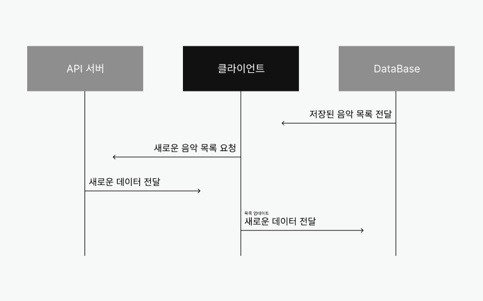
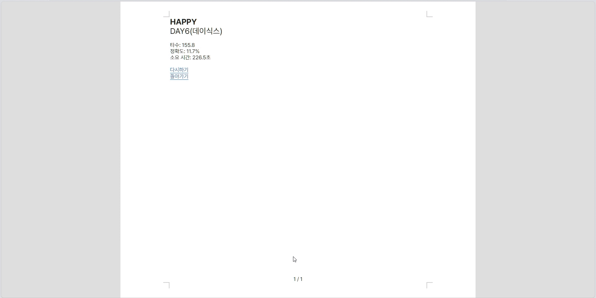
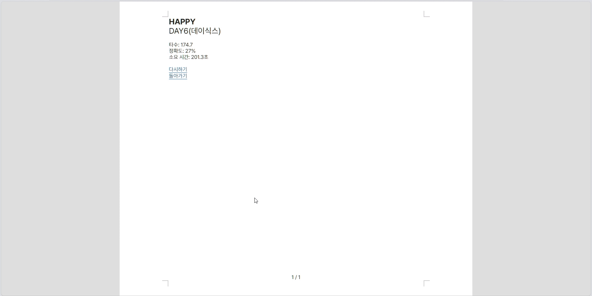

# 타자연습 개발 문서
이 문서는 타자연습 프로젝트 개발 내용을 설명합니다. 
## 목차
### 1. 이해하기
  1. **기능 소개**  
     - 초기화면
     - 입력화면
     - 결과화면
     - 로딩화면
  2. **기능 작동 예시**  
      - 초기화면
      - 입력화면
      - 결과화면
      - 로딩화면
  3. **JavaScript 활용 예시**  
      - 초기화면
        - 목차생성
        - 목차넘김
        - 목록이동
        - 업데이트
      - 입력화면
        - 문장생성
        - 오타표시
        - 커서표시
        - 한영표시
      - 결과화면
        - 결과측정
        - 다시하기
        - 돌아가기
      - 로딩화면

### 2. 활용하기   
 - 초기화면
   - 목차생성
   - 목차넘김
   - 목록이동
   - 업데이트
 - 입력화면
   - 문장생성
   - 오타표시
   - 커서표시
   - 한영표시
 - 결과화면
   - 결과측정
   - 다시하기
   - 돌아가기 
 - 로딩화면

### 3. 보완 사항
   - 에러 처리
   - 테스트 가이드

## 1. 이해하기
이 섹션은 타자연습 주요 기능과 작동 방식에 대해 설명합니다.   

**흐름도**    


### 1.1. 기능 소개
---
### 초기화면
---
초기화면은 `목차생성`, `목차넘김`, `목록이동`, `업데이트` 기능을 제공합니다.

`목차생성`은 두 함수를 걸쳐 반환된 음악 목록, **목차**를 생성합니다. **getMusicList** 함수와 **getListPage** 함수를 활용합니다. **getMusicList** 함수는 `API`를 통해 데이터를 부여 받아 객체로 가공합니다. **getListPage** 함수는 페이지 별 목록 개수를 지정하여 음악 목록 페이지 배열을 반환합니다.    

`목차넘김`은 목차 페이지를 이전, 이후로 이동합니다. **목차** 길이를 초과, 미만의 페이지로 이동할 수 없습니다.

`목록이동`은 선택한 목록으로 이동합니다. `문장생성`이 되어 있지 않은 목록은 `목록이동`이 제한됩니다.

`업데이트`는 목차를 최신화합니다. 최신 데이터는 DB에 덮어씌워집니다. DB 리소스를 최소화하기 위해 API 요청을 제한합니다. 

### 입력화면
---
입력화면은 `문장생성`, `오타표시`, `커서표시`, `한영표시` 기능을 제공합니다.    

`문장생성`은 하나의 함수를 거쳐 문장을 생성합니다. **splitLyric** 함수는 가사를 인자로 받습니다. 가사는 문장으로, 문장은 문자로 분할되어 페이지 당 지정한 문장 수를 배열로 가진 객체로 반환합니다. 반환된 객체는 페이지 숫자를 **key**로 가지고 있습니다. 페이지 숫자에 맞춰 해당 **key**가 가진 문장 배열을 화면에 생성합니다.

`오타표시`는 생성된 문자와 입력한 문자의 일치를 나타냅니다. 입력한 문자와 입력하고 있는 문자, 두 종류의 경우로 구분하여 문자 일치여부를 확인합니다. 일치 여부에 따라 지정한 **className**을 부여합니다. 

`커서표시`는 현재 입력할 문자를 표시합니다. `input` 속성을 이용하여 발생한 이벤트에 따라 **커서**가 움직입니다. **커서**는 **top**과 **left**의 `css` 속성에 변수가 적용되어 `Javascript`에서 픽셀값이 변동됩니다.

`한영표시`는 현재 입력한 문자가 한글인지 영어인지 표시합니다. 특수문자를 입력하는 경우 현재값이 유지됩니다.

### 결과화면
---
결과화면은 `결과측정`, `다시하기`, `돌아가기` 기능을 제공합니다.    

`결과측정`은 **타수**, **정확도**, **소요시간**을 측정합니다. `입력화면`에서 사용자가 문자를 입력할 때부터 마지막 문자를 입력했을 때까지의 문자열과 시간을 기록합니다. 계산과정을 거쳐 **결과화면**으로 이동하여 사용자에게 측정 결과를 보여줍니다. 

`다시하기`는 입력 완료한 주제를 다시 시작합니다. `결과측정`을 초기화하여 **입력화면** 첫 페이지로 이동합니다.

`돌아가기`는 **초기화면**으로 이동합니다.

### 로딩화면
---
로딩화면은 **데이터 로드 처리 상태**를 시각적으로 보여줍니다.    

`업데이트` 할 때만 모달창으로 출력됩니다.

### 1.2. 기능 작동 예시
---

<h3>초기화면</h3>
<p>
  <b>목차생성, 목차넘김</b>
</p>


<p>
  <b>목록이동</b>
</p>


<p>
  <b>업데이트</b>
</p>


---
<h3>입력화면</h3>
<p>
  <b>문장생성, 오타표시, 커서이동, 한영표시</b>
</p>


---
<h3>결과화면</h3>
<p>
  <b>결과측정</b>
</p>


<p>
  <b>다시하기</b>
</p>



<p>
  <b>돌아가기</b>
</p>



---
<h3>로딩화면</h3>
<p>
  <b>목차 불러올 때</b>
</p>


### 1.3. JavaScript 활용 예시
---

| 개발 플랫폼  | 분류 |  기능  |           참고           |
| :---------: | :----: | :---: | :----------------------: |
|  Javascript | 초기화면  | 목차생성 |     [ 예제 ](#211-목차생성)        |
|      -      |     -    | 목차넘김 |     [ 예제 ](#212-목차넘김)        |
|      -      |     -    | 목록이동 |     [ 예제 ](#213-목록이동)        |
|      -      |     -    | 업데이트 |     [ 예제 ](#214-업데이트)        |
|      -      |  입력화면 | 문장생성 |     [ 예제 ](#221-문장생성)        |
|      -      |     -    | 오타표시 |     [ 예제 ](#222-오타표시)        |
|      -      |     -    | 커서표시 |     [ 예제 ](#223-커서표시)        |
|      -      |     -    | 한영표시 |     [ 예제 ](#224-한영표시)        |
|      -      |  결과화면 | 결과측정 |     [ 예제 ](#231-결과측정)        |
|      -      |     -    | 다시하기 |     [ 예제 ](#232-다시하기)        |
|      -      |     -    | 돌아가기 |     [ 예제 ](#233-돌아가기)        |
|      -      |  로딩화면 |   로딩  |     [ 예제 ](#241-로딩)          |

## 2. 활용하기  
이 섹션은 JavaScript를 사용한 타자연습 기능 구현 방법을 안내합니다.   

*코드의 가독성을 위해 필요한 JSX 컴포넌트의 props만 작성되었고 태그 속성은 생략되었습니다.*
### 2.1. 초기화면
---
### 2.1.1. 목차생성
이번 차례는 목차생성 기능을 안내합니다.

- 코드    

  ```javascript
  // createSwiper.jsx
  import useFetchData from '@/hook/useFetchData';

  export default function CreateSwiper() {
    const [type, setType] = useState('LOAD');
    const [pageNumber, setPageNumber] = useState(0);
    const { loadingPercent, page } = useFetchData(type);

    return (
        ...
        <SwiperSlides item={page[pageNumber]} />
        ...
    );
  }
  ```
  ```javascript
  // swiperSlides.jsx
  export default function SwiperSlides({ item }) {
    return (
      ...
        {item.map((value, idx) => {
          const { 
            trackId, 
            currentRank, 
            artists, 
            trackTitle, 
            isLyric } = value;
          const artistsNames = artists.map((value) => value.artistName);
          const artist = artistsNames.join().replace(',', ', ');
          return (
              <div>
                <div>
                  {currentRank}
                </div>
                <div>
                  <div>
                    {trackTitle}
                  </div>
                  <div>
                    {artist}
                  </div>
                </div>
              </div>
          );
        })}
      ...
    );
  }
  ```
- 설명    
  **컴포넌트 동작**    
  `<SwiperSlides/>` 컴포넌트는 **item** 인자가 가지고 있는 배열 길이 만큼 레이어를 생성합니다. **page**는 객체 유형으로 해당 페이지 수에 맞는 목록을 가지고 있습니다. **page[pageNumber]** 는 **page** 객체의 해당 값(배열)을 나타냅니다.     
  
  목차 페이지를 넘기면 **page**의 다음 프로퍼티의 값, **page[pageNumber]** 배열을 반환합니다.  

- 활용    

  **커스텀 훅 확장**    
  **useFetchData.js**에서 **type**을 전달 받거나 변경할 때마다 해당 **type**에 맞는 `API`를 호출합니다. **type**을 조건을 추가하여 `useFetchData` 함수를 확장할 수 있습니다.

### 2.1.2. 목차넘김
이번 차례는 목차넘김 기능을 안내합니다.

- 코드    

  ```javascript
  // createSwiper.jsx
  ...
  export default function CreateSwiper() {
    const [pageNumber, setPageNumber] = useState(0);

    function onClickNextPage() {
      if (pageNumber < page.length - 1) {
        setPageNumber((num) => num + 1);
      }
    }

    function onClickPrevPage() {
      if (pageNumber > 0) {
        setPageNumber((num) => num - 1);
      }
    }
    return (
      ...
        <div>
          <div onClick={onClickPrevPage}>
            
          </div>
          <divonClick={onClickNextPage}>
            
          </div>
        </div>
      ...
    );
  }
  ```
- 설명    
  **컴포넌트 동작**    
  **onClickPrevPage**, **onClickNextPage** 함수는 **pageNumber** 숫자를 증가시키거나 감소시킵니다. 각 함수에 부여된 조건은 **page** 객체 프로퍼티의 길이 안에서 동작하도록 합니다.     
  > **page**의 프로퍼티 길이는 전체 페이지 수 입니다. 

### 2.1.3. 목록이동
이번 차례는 목록이동 기능을 안내합니다.   

- 코드    

  ```javascript
  // swiperSlides.jsx
  import Link from 'next/link';

  export default function SwiperSlides({ item }) {
    return (
      ...
        {item.map((value, idx) => {
          ...
          return (
            <Link key={idx} href={`/music/${trackId}`}>
              <div>
                <div>{currentRank}</div>
                <div>
                  <div>{trackTitle}</div>
                  <div>{artist}</div>
                </div>
              </div>
            </Link>
          );
        })}
      ...
    );
  }
  ```
  ```javascript
  // src/pages/music/[id].jsx
  export const getServerSideProps = async (data) => {
    const trackId = await data.query.id;
    return { props: { trackId } };
  };

  export default function Page({ trackId }) {
    ...
  }
  ```
- 설명    
  **컴포넌트 동작**    
  `<Link>` 컴포넌트는 주소를 지정한 **herf**로 이동시킵니다. `music/${trackId}` 주소는 `pages/music` 폴더의 `[id].jsx` 파일을 실행합니다.     
  
  **파라미터 동적 할당**    
  `trackId`는 사용자의 목차 항목 선택에 따라 변경됨으로 **경로 파라미터** 동적 할당을 허용해야 합니다. `[id]` 파일명으로 파일을 생성하여 경로 동적할당을 허용할 수 있습니다. 또한 `[id].jsx` 파일은 `getServerSideProps` 함수로 **url**에 접근할 수 있습니다.    

  `<Link>` 컴포넌트는 `DOM`에서 `<a>` 태그로 표시됩니다. 

- 활용    
  **href** 링크를 지정하여 원하는 파일링크로 이동할 수 있습니다. 
  > [Next 라우팅 공식 문서 참고](https://nextjs.org/docs/app/building-your-application/routing/pages) 

### 2.1.4. 업데이트
이번 차례는 업데이트 기능을 안내합니다.   

- 코드    

  ```javascript
  // createSwiper.jsx
  import dayjs from 'dayjs';
  import useFetchData, { readData, updateData } from '@/hook/useFetchData';

  const nextUpdateTime = dayjs(Date.now())
    .add(1, 'd')
    .set('h', 7)
    .set('m', 0)
    .set('s', 0)
    .set('ms', 0)
    .format('YYYY/MM/DD HH:mm:ss:SSS');
  let restTimeToUpdateHour = dayjs(nextUpdateTime)
    .diff(new Date(), 'h') + 1;

  export default function CreateSwiper({ item }) {
    const [type, setType] = useState('LOAD');
    const [isClickAble, setIsClickAlble] = useState(false);
    const { loadingPercent, page } = useFetchData(type);

     useEffect(() => {
      // 업데이트 버튼 정보 불러오기
      async function fetchUpdateTimeInfo() {
        const updateTimeInfo = await readData('updateTime');
        const { click, next } = updateTimeInfo;
        const isable = new Date(next) <= new Date();
        setIsClickAlble(isable);
      }
      try {
        fetchUpdateTimeInfo();
      } catch {
        console.error('FetchUpdateTimeInfo Error');
        setIsClickAlble(false);
      }
    }, []);

    function onClickUpdateHandler() {
      if (!isClickAble) {
        return console.log(`${restTimeToUpdateHour}시간 후에 업데이트 가능`);
      }
      try {
        const updateTime = {
          next: nextUpdateTime,
          click: dayjs(Date.now()).format('YYYY/MM/DD HH:mm:ss:SSS'),
        };
        ...
        // 목차 갱신
        setType('UPDATE');
        // DB 시간 업데이트
        updateData('updateTime/', updateTime);
        // 업데이트 버튼 비활성화
        setIsClickAlble(false);
      } catch {
        console.error('UpdateTime Error');
        restTimeToUpdateHour = 'n';
        if (loadingPercent === 100) setIsError(true);
        setIsClickAlble(false);
      }
    }

    return (
      ...
        <div
          onClick={onClickUpdateHandler}
          title={isClickAble ? 
            '현재 업데이트 가능' : 
            `${restTimeToUpdateHour}시간 후에 업데이트 가능`}
        >
          <p>업데이트</p>
        </div>
      ...
    );
  }
  ```
  
- 설명    
  **컴포넌트 동작**      
  `초기화면`이 처음 로드될 때 `fetchUpdateTimeInfo` 함수로부터 업데이트 정보를 받습니다. 업데이트 정보는 `DB`로부터 업데이트된 시간 **click**, 업데이트 가능 시간 **next**를 가져옵니다. 현재 시간과 **next**와 비교하여 **isable** 값을 할당합니다. **isable**에 따라 업데이트를 할 수 있습니다. 업데이트를 누르지 못할 경우 업데이트 가능 시간을 `title` 속성으로 안내합니다.   

  **업데이트 동작**    
  업데이트를 할 경우 **type**이 변경되어 `useFetchData` 함수가 동작합니다. `DB`의 업데이트 정보를 지정한 양식에 맞춰 갱신합니다. `API` 호출을 제한하는 이유는 불러오는 데이터를 해당 `DB` 카테고리를 전부 덮어씌우기 때문에 `DB` 비용을 최소화하기 위해서입니다. 

### 2.2. 입력화면
---
### 2.2.1. 문장생성
이번 차례는 문장생성 기능을 안내합니다.   

- 코드   

  ```javascript
  // src/pages/music/[id].jsx
  export const getServerSideProps = async (data) => {
    const trackId = await data.query.id;
    return { props: { trackId } };
  };

  export default function Page({ trackId }) {
    const { dataObj, pageSheet, loadingPercent } = 
      useFetchData('ID', Number(trackId));
    const [pageSheetIdx, setPageSheetIdx] = useState(0);
    const [isFinished, setIsFinished] = useState(false);
    const { dispatch, state } = useContext(Context);
    ...
    switch (isFinished) {
      case true: {
        return (
          <ResultPage/>
        );
      }
      case false: {
        return (
          <>
            ...
              <div className={styles['id-main']}>
                <h1>{dataObj.music.trackTitle.replace(/\(.*/g, ''))}</h1>
                <p>{dataObj.artistName}</p>
                <Sentence
                  key={pageSheetIdx}
                  pageSheet={pageSheet}
                  pageSheetIdx={pageSheetIdx}
                  ...
                />
                <div>
                  <p>
                    {pageSheetIdx + 1} / {Object.keys(pageSheet).length}
                  </p>
                </div>
              </div>
            ...
          </>
        )
      }
    }
  }
  ```
  ```javascript
  // sentence.jsx
  export default function Sentence({ pageSheet, pageSheetIdx }) {
    ...
    return (
      <>
        <ul>
          {pageSheet[pageSheetIdx].map((ly, i) => <Lyric_li ly={ly} />)}
        </ul>
        <label>
          <TextInput/>
        </label>
      </>
    );
  }
  ```
  ```javascript
  // lyric_li.jsx
  export default function Lyric_li({ ly }) {
    return (
      <li>
        {ly.map((txt, idx) => <Letter>{txt}</Letter>)}
      </li>
    );
  }
  ```
  ```javascript
  // letter.jsx
  function Letter({ children }) {
    ...
    return children === '\n' ? <br/> : <span>{children}</span>
  }
  export default memo(Letter);
  ```
- 설명   
  **컴포넌트 동작**     
  `<ResultPage/>` 컴포넌트는 **isFinished** 변수가 참이면 출력됩니다.
  
  `<Sentence/>` 컴포넌트는 **isFinished** 변수가 거짓이면 출력됩니다. **pageSheetIdx** 변수가 `0`이면, 첫 페이지를 출력해야 함으로 **pageSheet** 객체의 첫 프로퍼티 배열을 출력합니다. **pageSheetIdx**는 **pageSheet**의 프로퍼티 개수 만큼 증가합니다.

  `<Lyric_li/>` 컴포넌트는 하나의 문장을 만듭니다. 배열 요소를 인자로 받는 `<Letter/>` 컴포넌트는 줄바꿈을 판별하여 하나의 문자를 태그로 출력합니다. 완성된 페이지는 모든 문자가 `<li>` 태그로 감싸져 있는 구조로 구성됩니다.

  `<Letter/>` 컴포넌트는 문장을 문자로 나눕니다. 하나의 문장을 인자로 받아 각각 문자 요소로 출력합니다. 모든 문자는 `<span>` 태그로 감싸져 있어 입력하는 문자와 비교합니다. 일치 여부에 따라 클래스명을 동적으로 부여합니다. 입력 비교 문자 외 리렌더링을 방지하기 위해 내보내는 컴포넌트를 `memo` 함수를 적용합니다.  

  **특정 데이터 KEY 가져오기**     
  **trackId**는 이동한 주소에서 가져옵니다. 해당 값은 `useFetchData`의 두 번째 인자로 할당됩니다. **trackId**는 문자열 형태로 가져와지기 때문에 엄격검사를 통과하기 위해 숫자로 형변환을 합니다. `FireBase`에서 **trackId**와 일치하는 항목이 있다면 함수 내부 동작에 따라 **dataObj**, **pageSheet** 변수를 반환합니다. **dataObj**는 항목의 메타데이터를, **pageSheet**은 항목의 문장 배열을 가지고 있습니다. 

  **loadingPercent**가 `100`이 되면 **pageSheet**의 문장 배열을 화면에 생성합니다.

  **문장 생성 동작**     
  **pageSheet** 변수는 `splitLyric` 함수가 반환한 각 페이지 별 문장을 문자 배열로 가지고 있는 객체입니다.   
  `{ 0: [['안', '녕', '하', '세', '요'], ...], 1: [[...]] }`  

  `splitLyric` 함수는 **trackId**와 일치하는 음악을 인자로 받아 한 페이지에 제한한 문장 수에 맞춰 페이지 별로 객체를 생성합니다. *첫 페이지 27줄, 이후 29줄*


### 2.2.2. 오타표시
이번 차례는 오타표시 기능을 안내합니다.   

- 초기설정    
  ```javascript
  // sentence.jsx
  export default function Sentence({ pageSheet, pageSheetIdx }) {
    const [typingtext, setTypingText] = useState('');
    const [typingSentenceNum, setTypingSentenceNum] = useState(0);
    const [sentenceArr, setSentenceArr] = useState([]);
    ...
    return (
      <>
        <ul>
          {pageSheet[pageSheetIdx].map((ly, i) => {
            return (
              <Lyric_li
                ly={ly}
                typingtext={typingtext}
                sentenceArr={sentenceArr}
                lyricSentenceNum={i}
                typingSentenceNum={typingSentenceNum}
              />
            );
          })}
          ...
        </ul>
        ...
      </>
    );
  }
  ```
  ```javascript
  // lyric_li.jsx
  export default function Lyric_li({ 
      ly, 
      typingtext, 
      sentenceArr 
      typingSentenceNum, 
      lyricSentenceNum, 
    }) {
    return (
      <li>
        {ly.map((txt, idx) => {
          return (
            <Letter
              typingtext={typingtext[idx]}
              sentenceArr={sentenceArr}
              lyricTextNum={idx}
              lyricSentenceNum={lyricSentenceNum}
              typingSentenceNum={typingSentenceNum}
            >
              {txt}
            </Letter>
          );
        })}
      </li>
    );
  }
  ```
- 코드    
  ```javascript
  // letter.jsx
  export default function Letter({ 
      children, 
      typingtext, 
      typingSentenceNum, 
      lyricSentenceNum, 
      lyricTextNum, 
      sentenceArr 
    }) {
  const isTypingLetterIdxCorrect = typingtext && 
    lyricSentenceNum === typingSentenceNum;
  const storedSentence = sentenceArr[lyricSentenceNum];

  const cssName = isTypingLetterIdxCorrect ? 
    (typingtext === children ? styles.correct : styles.wrong) : '';
  const strCssName = !!storedSentence ? 
    storedSentence[lyricTextNum] === children ? styles.correct : styles.wrong
    : cssName;

    return children === '\n' ? 
      <br/> : <span className={strCssName}>{children}</span>
  }
  ```
- 설명  
  **컴포넌트 동작**  
  `<Letter/>` 컴포넌트는 사용자가 입력한 문자를 기존 문자(**children**)와 비교합니다. 동일하면 **correct**, 그렇지 않으면 **wrong**을 클래스명으로 동적 할당합니다. 이미 입력된 문장은 해당 문자위치(**storedSentence[lyricTextNum]**)와 일치하는지 비교하여 클래스명을 부여합니다. 
  
  > \<TextInput/> 컴포넌트에서 Enter 이벤트 발생 시    
  > Enter를 누르면 sentenceArr 변수에 문장 삽입, 페이지 이동, 페이지 넘어가면 sentenceArr 초기화   
  >> **typingSentenceNum**은 \<Sentence/> 컴포넌트가 생성되면 `0`으로 초기화 됩니다. 다음 페이지로 넘어가면 **sentenceArr**의 첫번째 문장부터 확인합니다.

  > [Next 스타일링 공식 문서 참고](https://nextjs.org/docs/app/building-your-application/styling/css-modules)   

### 2.2.3. 커서표시
이번 차례는 커서표시 기능을 안내합니다.   

- 초기설정
  ```css
  /* /styles/variables.css */
  :root {
    --cursor-top: 2px;
    --cursor-left: 0px;
  }
  ```
  ```javascript
  // _app.jsx
  import '@/styles/variables.css';

  export const Context = createContext(null);

  const initialArg = {
    time: null,
    accuracy: 0,
    typingSpeed: 0,
    cursor: {
      top: 2,
      left: 0,
    },
  };

  export function reducer(state, action) {
    switch (action.type) {
      ...
      case 'CURSORMOVE': {
        const { tagWidth, tagHeight, tagLeft, tagTop } = action;
        let cursorTopValue = state.cursor.top;
        let cursorLeftValue = state.cursor.left;
        switch (action.event) {
          case 'Typing': {
            cursorLeftValue += tagWidth;
            document.documentElement
              .style.setProperty('--cursor-top', `${cursorTopValue}px`);
            document.documentElement
              .style.setProperty('--cursor-left', `${cursorLeftValue}px`);
            return {
              ...state,
              cursor: {
                top: cursorTopValue,
                left: cursorLeftValue,
              },
            };
          }
          case 'Enter': {
            cursorTopValue = tagTop === 0 ? 
              2 : tagHeight + state.cursor.top;
            cursorLeftValue = 0;
            document.documentElement
              .style.setProperty('--cursor-top', `${cursorTopValue}px`);
            document.documentElement
              .style.setProperty('--cursor-left', `${cursorLeftValue}px`);
            return {
              ...state,
              cursor: {
                top: cursorTopValue,
                left: cursorLeftValue,
              },
            };
          }
          case 'Backspace': {
            cursorTopValue = state.cursor.top;
            cursorLeftValue = tagLeft === 0 ? 
              tagLeft : state.cursor.left - tagWidth;
            document.documentElement
              .style.setProperty('--cursor-top', `${cursorTopValue}px`);
            document.documentElement
              .style.setProperty('--cursor-left', `${cursorLeftValue}px`);
            return {
              ...state,
              cursor: {
                top: cursorTopValue,
                left: cursorLeftValue,
              },
            };
          }
        }
      }
    }
  }
  ```

- 코드    
  ```javascript
  // textInput.jsx
  import { Context } from '@/pages/_app';

  let isFull = false;
  let composedText = '';
  let isBlur = false;

  export default function TextInput({
    typingtext,
    sentenceArr,
    setTypingText,
    currentTextArr,
    setSentenceArr,
    typingSentenceNum,
    setTypingSentenceNum,
  }) {
    const { dispatch } = useContext(Context);

    return (
      <input
        ...
        onBlur={() => isBlur = true}
        onFocus={() => isBlur = false}
        onChange={...}
        onKeyDown={...}
        onCompositionStart={...}
        onCompositionUpdate={...}
        onCompositionEnd={...}
      />
    );
  }
  ```
- 설명    
  **컴포넌트 동작**   
  문자를 입력하면 언어에 따라 해당 이벤트가 작동합니다.    

  ```
  영문: onKeyDown
  조합형 입력 문자: onComposition 예) 한글, 중국어, 일본어
  ```

  **커서**는 입력한 문자 다음에 위치해야 합니다. **커서**는 이벤트가 작동하면 기존(입력되어야 하는) 문자의 크기 만큼 이동합니다. 문자는 태그로 감싸져 있어, 태그는 문자 만큼의 너비를 가지고 있습니다. 태그를 선택을 하기 위해 **입력한 문자 길이**를 활용합니다. 
  
  **커서 위치 지정**    
  **커서**의 **left**, **top**은 태그의 너비, 높이 만큼 할당됩니다. 값의 단위는 `px`입니다. 정확한 위치값을 가져오기 위해 `getBoundingClientRect` 함수를 사용합니다. 해당함수는 **offsetWidth** 프로퍼티와 다르게 위치값을 소수점으로 반환합니다.

  **유의사항**    
  `onComposition` 관련 이벤트 설정 시 `onKeyUp`, `onKeyDown` 이벤트도 동작합니다. `e.key = 'Progress'`
  > 관련 이벤트: **onCompositionStart**, **onCompositionUpdate**, **onCompositionEnd**

- **\<input onChange={} />**     

  ```javascript
  onChange={(e) => {
    const txt = e.target.value;
    const generatedSentence = currentTextArr[typingSentenceNum];
    // 작성 문자 길이 제한
    if (generatedSentence.length >= txt.length) {
      setTypingText(txt.slice(0, generatedSentence.length));
    }
  }}
  ```
  `onChange` 이벤트는 키보드를 누르는 만큼 입력됩니다. **커서** 오작동을 방지하기 위해 입력 길이를 제한합니다. 조건문은 기존 문자 길이 이상을 입력할 때 **커서 이동**을 방지합니다.    

- **\<input onKeyDown={} />**     
  `onKeyDown`은 키보드 눌림을 감지합니다. 키보드를 누르고 때지 않으면 이벤트가 연속적으로 발생합니다. 키보드 이벤트는 `e.key`로 구분하여 **Enter**, **Backspace**, **default**로 나뉘어져 있습니다.    
  
  **1. case 'Enter'**
  ```javascript
  onKeyDown={(e) => {
    const generatedSentence = currentTextArr[typingSentenceNum];
    const liTags = document.getElementsByTagName('li');
    switch (e.key) {
      case 'Enter': {
        if (
          generatedSentence.length === typingtext.length ||
          (generatedSentence[0] === '\n' && typingtext === '')
        ) {
          setSentenceArr((prev) => [...prev, typingtext]);
          setTypingSentenceNum((prev) => prev + 1);
          setTypingText('');
          isFull = false;
          // 다음 페이지 커서 위치 초기화 (sentenceArr 한 박자 늦게 추가됨)
          if (sentenceArr.length + 1 === currentTextArr.length) {
            dispatch({ type: 'CURSORMOVE', event: 'Enter', tagTop: 0 });
            break;
          }
          // 태그 선택 (다음 줄)
          const selectedLetterTag = liTags[typingSentenceNum + 1];
          // 태그 크기
          const tagHeight = Number(
            selectedLetterTag
              .getBoundingClientRect()
              .height
              .toFixed(2)
          );
          dispatch({ type: 'CURSORMOVE', event: 'Enter', tagHeight });
          break;
        } else if (generatedSentence.length > typingtext.length) {
          alert('문장 전체를 입력해주세요');
          break;
        }
      }
      ...
  ```     
  **다음 문장 이동**    
  `Enter`를 눌렀을 때 생성된 문장(**generatedSentence**)과 사용자가 입력한 문장(**typingtext**)의 길이가 동일하다면 `dispatch` 함수를 동작시킵니다. 해당 `dispatch` 함수는 **커서 top 위치**를 **tagHeight** 만큼 하단으로, **커서 left 위치**는 `0`으로 초기화 합니다.     
  
  **다음 페이지 이동**    
  `Enter`를 눌렀을 때 현재 페이지에서 생성된 문장(**sentenceArr**)과 사용자가 입력한 문장(**currentTextArr**) 수가 동일하다면 `dispatch` 함수를 동작시킵니다. 해당 `dispatch` 함수는 **커서 top 위치**를 `0`으로, **커서 left 위치**는 `0`으로 초기화 합니다.

  **세부설명**    
  `isFull = false;`   

  : `onComposition` 관련 이벤트에서 필요한 코드입니다. 줄 바꿈이 되었을 때 **isFull** 변수를 **false**로 초기화 합니다. **isFull**은 입력 문장과 기존 문장의 길이 일치 여부를 나타냅니다.

  **2. case 'Backspace'**
  ```javascript
  case 'Backspace': {
    isFull = false;
    // 현재 문자 인덱스
    const typingtextIdx = typingtext.length - 1;
    if (typingtextIdx < 0) {
      dispatch({ type: 'CURSORMOVE', event: 'Backspace', tagLeft: 0 });
      break;
    }
    // 태그 선택 (현재 문자)
    const selectedLetterTag = 
      liTags[typingSentenceNum].children[typingtextIdx];
    // 태그 크기
    const tagWidth = Number(
      selectedLetterTag.getBoundingClientRect().width.toFixed(2)
    );
    dispatch({ type: 'CURSORMOVE', event: 'Backspace', tagWidth });
    break;
  }
  ```      
  **문자 삭제**   
  `Backspace`를 눌렀을 때 **커서**는 현재 입력된 마지막 문자 너비(**tagWidth**) 만큼 **커서** 좌측으로 이동합니다. 삭제할 문자가 없는 경우, 문자 인덱스가 `0` 미만이기 때문에 **커서 left 위치**를 `0`으로 초기화 합니다. 

  **유의사항**    
  선택한 태그(**selectedLetterTag**)는 커서가 뒤로 가야 할 너비의 태그여야 합니다. 
  > **Enter**, **default** 부분과 **selectedLetterTag** 변수 선언 코드가 다름으로 유의해야 합니다. 

  `isFull = false;`   
  : `onComposition` 관련 이벤트에서 필요한 코드입니다. 문자를 삭제했을 때 **isFull** 변수를 **false**로 초기화 합니다. **isFull**은 입력 문장과 기존 문장의 길이 일치 여부를 나타냅니다.

  **3. case default**
  ```javascript
  default: {
    if (e.key.length > 1) return;
    // 현재 문자 인덱스
    const typingtextIdx = typingtext.length - 1;
    // 작성 문자 길이 제한
    if (generatedSentence.length < typingtext.length + 1) return;
    // 태그 선택 (다음 문자)
    const selectedLetterTag = 
      liTags[typingSentenceNum].children[typingtextIdx + 1];
    // 태그 크기
    const tagWidth = Number(
      selectedLetterTag.getBoundingClientRect().width.toFixed(2)
    );
    dispatch({ type: 'CURSORMOVE', event: 'Typing', tagWidth });
  }}}
  ```
  **영문 숫자 입력**    
  영문, 숫자, 특수문자는 **e.key.length**가 한 자리수로, 해당 문자를 입력했을 때 **default**문을 수행합니다. 그외 키보드 입력을 제한합니다. 입력한 문자열 길이(**typingtext**)가 생성된 문장의 길이(**generatedSentence**) 이상일 때 필요 길이 이상으로 **커서**가 움직이는 것을 방지합니다.    

  `onChange`, `onKeyDown`은 함께 동작하기 때문에 두 이벤트에서 **커서** 이동 제한을 적용합니다.     

  문자를 입력할 때 `dispatch` 함수가 동작합니다. `dispatch` 함수는 **커서**를 입력한 문자 너비(**tagWidth**) 만큼 우측으로 이동시킵니다.  
  
  *영문, 숫자, 기본 특수문자를 입력한 경우만 **default** 구문이 동작합니다.*

- **\<input onCompositionStart={} />**    
  `onCompositionStart` 이벤트는 조합형 입력 시작을 감지합니다. 

  ```javascript
  onCompositionStart={(e) => {
    const txt = e.target.value;
    const generatedSentence = currentTextArr[typingSentenceNum];
    // 현재 문자 인덱스
    const typingtextIdx = txt.length; // 기본 0
    // 작성 문자 길이 제한
    if (generatedSentence.length < txt.length + 1) return (isFull = true);
     if (isFull || typingtextIdx < 0) return;
    // 태그 선택
    const liTags = document.getElementsByTagName('li');
    const selectedTag = 
      liTags[typingSentenceNum].children[typingtextIdx];
    // 태그 크기
    const tagWidth = Number(
      selectedLetterTag.getBoundingClientRect().width.toFixed(2)
    );
    dispatch({ type: 'CURSORMOVE', event: 'Typing', tagWidth });
  }}
  ```
  **조합형 문자 입력**   
  감지된 문자는 항상 빈 문자로 시작됩니다. **onKeyDown** 이벤트와 인덱스 변수 초기 선언 값이 다릅니다. 조합형 문장(**txt**)이 생성된 문장(**generatedSentence**)보다 길면 **isFull**을 **true**로 할당합니다. **isFull**은 `onComposition` 관련 이벤트 동작을 제한하는 역할을 합니다.   

  `txt.length + 1`은 **txt**가 빈 문자열로 시작하기 때문에 `1`을 더하여 문장에서 마지막 문자 이전에 **isFull** 변수가 **true**로 반환되지 않도록 합니다.

- **\<input onCompositionUpdate={} />**    
  `onCompositionStart` 이벤트는 조합형 문자 입력 중을 감지합니다. 

  ```javascript
  onCompositionUpdate={(e) => {
    const txt = e.target.value;
    composedText = txt;
  }}
  ```  
  **조합형 문자 입력 업데이트**   
  문자를 이어서 작성할 때 `onCompositionUpdate` 이벤트가 동작합니다. 입력한 문자를 **composedText** 변수에 할당합니다.

  **composedText** 변수는 항상 한 글자 이상을 가지고 있습니다. 조합형 문자를 지울 때 사용됩니다.
  
- **\<input onCompositionEnd={} />**    
  `onCompositionEnd` 이벤트는 조합형 문자 완성을 감지합니다.

  ```javascript
  onCompositionEnd={(e) => {
    // input value가 isFull이면 최대 길이로 고정
    const txtLength = isFull ? 
      typingtext.length : e.target.value.length;
    // 현재 문자 인덱스
    const typingtextIdx = txtLength;
    // 태그 선택
    const liTags = document.getElementsByTagName('li');
    const selectedliTagLength = 
      liTags[typingSentenceNum].children.length;
    const selectedLetterTag = 
      liTags[typingSentenceNum].children[typingtextIdx];
    // 작성 문자 길이 제한
    if (0 > txtLength) return; // -1부터 backspace 적용
    // 문장 길이 일치하면 넘어감 (Enter)
    if (selectedliTagLength <= txtLength && !isBlur) return; 
    if (isBlur) {
      // 사라진 태그 선택
      const selectedLetterTag = 
        liTags[typingSentenceNum].children[typingtextIdx - 1];
      // 태그 크기
      const tagWidth = Number(
        selectedLetterTag.getBoundingClientRect().width.toFixed(2)
      );
      // 커서 이동
      dispatch({ type: 'CURSORMOVE', event: 'Backspace', tagWidth });
      return;
    }
    // 태그 크기
    const tagWidth = Number(
      selectedLetterTag.getBoundingClientRect().width.toFixed(2)
    );
    // 이전 문자가 현재 문자 길이보다 길 때
    if (composedText.length > txtLength) {
      // 커서 이동
      dispatch({ type: 'CURSORMOVE', event: 'Backspace', tagWidth });
      isFull = false;
      return;
    }
    composedText = '';
  }}
  ```
  **input blur될 때 커서 이동**   
  `input`에서 벗어나면 `onBlur` 이벤트가 동작합니다. 조합형 문자를 입력 중이면 입력 중인 문자는 사라지며 `onCompositionEnd` 이벤트가 동작합니다. 이때 커서 위치는 변경되지 않습니다. `onBlur`가 발생하여 문자가 사라질 때 커서도 함께 움직이도록 `onCompositionEnd` 이벤트를 설정합니다. 

  **blur**가 참이면 사라진 문자 태그의 너비를 구하여 **커서**를 이동시킵니다. 입력한 문자가 사라질 때 `onCompositionEnd` 이벤트는 사라지기 전의 문자를 가지고 있습니다.

  **문자 삭제**   
  입력한 문장이 **isFull**이면 문장 최대 길이로 고정하고 아니면 현재 입력한 문장 길이를 **txtLength** 변수에 할당합니다. **composedText**는 항상 문자를 가지고 있습니다. 먼저 입력된 문장(**composedText**) 길이가 수정한 문장 길이(**txtLength**)보다 작으면 **커서**를 뒤로 이동시킵니다.

  **세부설명**    
  `if (0 > txtLength) return;`    
  : 해당 코드는 조합형 첫번째 문자 삭제 예외상황을 처리합니다. `0`을 포함해야 조합형 문자 첫글자를 지우고 **커서**를 이동시킬 수 있습니다. `0`을 포함하지 않는다면 **커서**는 앞으로 한칸 움직인 상태에서 뒤로 한칸 움직이지 않습니다. `onCompositionEnd`가 끝난 이후 **backspace**를 누르면 `onKeyDown`이 적용됩니다.
  
  `onCompositionEnd`은 단독으로 동작할 수 없습니다. `onCompositionStart`가 동작해야 발생합니다. `onCompositionStart`는 조립형 문자를 입력할 때만 동작합니다.

### 2.2.4. 한영표시
이번 차례는 한영표시 기능을 안내합니다.   

- 코드
  ```javascript
  // sentence.jsx
  function detectLanguage(char = '', current) {
    const en = /[a-z]/gi.test(char);
    const ko = /[ㄱ-ㅎ|ㅏ-ㅣ|가-힣]/g.test(char);
    if (en) {
      return '영';
    } else if (ko) {
      return '한';
    } else {
      return current;
    }
  }

  export default function Sentence() {
    const [currentLang, setCurrentLang] = useState('');

    useEffect(() => {
      // 방금 작성한 문자 언어 검사
      if (!typingtext) return;
      const lastChar = typingtext[typingtext.length - 1];
      const lang = detectLanguage(lastChar, currentLang);
      setCurrentLang(lang);
      ...
    }, [typingtext]);

    return (
      ...
        <label htmlFor="textInput">
          <div>{currentLang.length !== 0 && currentLang}</div>
        </label>
      ...
    )
  }
  ```

- 설명    
  **기능 동작**   
  입력 글자는 **typingtext** 변수로 할당됩니다. 입력한 마지막 하나의 문자를 판별합니다. `detectLanguage` 함수는 마지막 문자(**lastChar**)와 현재 문자 상태(**currentLang**)를 인자로 받습니다. **lang** 변수는 입력한 마지막 글자 언어에 따라 '한', '영'을 반환합니다. 그외 언어를 입력하면 이전 상태를 반환합니다. 주로 특수문자를 처리할 때 반환됩니다. 

  언어 상태는 화면 좌측 상단에서 출력됩니다.

### 2.3. 결과화면
---
### 2.3.1. 결과측정
이번 차례는 결과측정 기능을 안내합니다.   

- 초기설정    
  ```javascript
  // _app.jsx
  export const Context = createContext(null);

  const initialArg = {
    time: null,
    accuracy: 0,
    typingSpeed: 0,
    cursor: {
      top: 2,
      left: 0,
    },
  };

  export function reducer(state, action) {
    switch (action.type) {
      case 'CALCULATE': {
        const { start, end, totalSentenceObj, pageSheet } = action;
        const totalPageCount = Object.keys(pageSheet).length;
        const pageSentenceLength = totalSentenceObj[i].length;
        const sentenceLength = totalSentenceObj[i][j].length;
        // 오타계산
        let wrongTextCount = 0;
        let totalTextCount = 0;
        for (let i = 0; i < totalPageCount; i++) {
          for (let j = 0; j < pageSentenceLength; j++) {
            for (let k = 0; k < sentenceLength; k++) {
              const originalLetter = pageSheet[i][j][k];
              const typedLetter = totalSentenceObj[i][j][k];
              totalTextCount += 1;
              if (originalLetter === typedLetter) continue;
              wrongTextCount += 1;
            }
          }
        }
        // 그외 계산
        const time = ((end - start) / 1000).toFixed(1);
        const accuracy = Number((
            ((totalTextCount - wrongTextCount) / totalTextCount) * 100
            ).toFixed(1));
        const typingSpeed = Number(
          ((totalTextCount / time) * 60).toFixed(1)
          );

        return {
          ...state,
          time,
          accuracy,
          typingSpeed,
        };
      }
      ...
    }
  }

  export default function App({ Component, pageProps }) {
    const [state, dispatch] = useReducer(reducer, initialArg);
    return (
      ...
        <Context.Provider value={{ dispatch, state }}>
          <Component {...pageProps} />
        </Context.Provider>
      ...
    );
  }
  ```
  ```javascript
  // sentence.jsx
  import { Context } from '@/pages/_app';

  let start = null;
  let isFirstTime = true;
  let totalSentenceObj = {};
  ...
  export default function Sentence({ 
      pageSheet, pageSheetIdx, setIsFinished, onEnterNextPage
    }) {
    const [typingtext, setTypingText] = useState('');
    const [typingSentenceNum, setTypingSentenceNum] = useState(0);
    const [sentenceArr, setSentenceArr] = useState([]);
    const { dispatch } = useContext(Context);

    useEffect(() => {
      if (sentenceArr.length === 0) return;
      // 한 페이지 작성 완료했을 때
      if (sentenceArr.length === pageSheet[pageSheetIdx].length) {
        totalSentenceObj[pageSheetIdx] = sentenceArr;
        setSentenceArr([]);
        onEnterNextPage();

        if (Object.keys(pageSheet).length !== pageSheetIdx + 1) return;
        // 모든 페이지 작성 완료했을 때
        setIsFinished(true);
        const end = Date.now();
        dispatch({ 
          type: 'CALCULATE', 
          start, 
          end, 
          totalSentenceObj, 
          pageSheet 
        });
        totalSentenceObj = {};
        isFirstTime = true;
        start = null;
      }
    }, [sentenceArr]);

    useEffect(() => {
      ...
      // 첫 입력 감지
      if (!isFirstTime) return;
      start = Date.now();
      isFirstTime = false;
    }, [typingtext]);

    return (
      <>
        ...
        <TextInput
          typingtext={typingtext}
          sentenceArr={sentenceArr}
          setTypingText={setTypingText}
          setSentenceArr={setSentenceArr}
          currentTextArr={pageSheet[pageSheetIdx]}
          typingSentenceNum={typingSentenceNum}
          setTypingSentenceNum={setTypingSentenceNum}
        />
      </>
    );
  }
  ```

- 코드    
  ```javascript
  // resultPage.jsx
  import { Context } from '@/pages/_app';

  export default function ResultPage({ music, artistName }) {
    const { state } = useContext(Context);
    ...
    return (
      <div>
        <h1>{music.trackTitle}</h1>
        <p>{artistName}</p>
        <ul>
          <li>- 타수: {state.typingSpeed}</li>
          <li>- 정확도: {state.accuracy}%</li>
          <li>
            - 소요 시간: {minute &&
            (minute.length === 2 ?
              minute + '분 ' : '0' + minute + '분 ')}
            {second.length === 2 ?
              second : 0 + second}초
          </li>
        </ul>
        <LinkBtn />
        <div>
          <p>1 / 1</p>
        </div>
      </div>
    );
  }
  ```

- 설명    
  **기능 동작**   
  **sentenceArr** 변수는 한 페이지에서 입력한 문장의 배열입니다.  **sentenceArr** 배열 요소가 삽입될 때마다 `useEffect`가 실행됩니다. `onEnterNextPage` 함수는 페이지 수(**pageSheetIdx**)를 증가시킵니다. **pageSheetIdx**가 전체 페이지 수(**Object.keys(pageSheet).length**)와 동일하면 **isFinished** 변수를 `true`로 변환합니다.     
  
  기록된 인자들은 **dispatch** 함수로 전달됩니다. `_app.jsx` 파일에서 작성한 **dispatch** 함수가 실행되어 함수에 할당된 변수들은 초기화 됩니다. 이후 `<ResultPage/>` 컴포넌트 화면에서 계산값이 표시됩니다. 

  **dispatch** 결과값은 `_app.jsx` 파일에서 `Context.Provider`를 적용하여 컴포넌트 전역에서 가져올 수 있습니다. 현재 `_app.jsx` 파일에서 전역 변수로 **dispatch**, **state**를 할당하고 있습니다.

  소요 시간은 **minute** 유무, 계산값 자리수에 따라 달리 출력됩니다.

### 2.3.2. 다시하기
이번 차례는 다시하기 기능을 안내합니다.   

- 초기설정    

  ```javascript
  // _app.jsx
  export const Context = createContext(null);

  const initialArg = {
    time: null,
    accuracy: 0,
    typingSpeed: 0,
    cursor: {
      top: 2,
      left: 0,
    },
  };

  function reducer(state, action) {
    switch (action.type) {
      ...
      case 'RESET': {
        document.documentElement.style.setProperty('--cursor-top', `2px`);
        document.documentElement.style.setProperty('--cursor-left', `0px`);
        return {
          ...state,
          time: null,
          accuracy: 0,
          typingSpeed: 0,
          cursor: {
            top: 2,
            left: 0,
          },
        };
      }
    }
  }

  export default function App({ Component, pageProps }) {
    const [state, dispatch] = useReducer(reducer, initialArg);
    return (
      <>
        ...
          <Context.Provider value={{ dispatch, state }}>
            <Component {...pageProps} />
          </Context.Provider>
        ...
      </>
    );
  }
  ```
  ```js
  // linkBtn.jsx
  export default function LinkBtn({ btns }) {
    return (
      <ul>
        {btns.map((btn, idx) => {
          return (
            <li key={idx} onClick={btn.onClick} title={btn.title}>
              {btn.description}
            </li>
          );
        })}
      </ul>
    );
  }
  ```

- 코드    

  ```javascript
  // resultPage.jsx
  import { Context } from '@/pages/_app';

  export default function ResultPage({ setIsFinished, setPageSheetIdx }) {
    const { dispatch, state } = useContext(Context);
    ...
    function reset() {
      dispatch({ type: 'RESET' });
      setIsFinished(false);
      setPageSheetIdx(0);
    }

    const btns = [
      {
        onClick: () => reset(),
        title: 'try again',
        description: '다시하기',
      },
      ...
    ];

    return (
     ...
        <LinkBtn btns={btns} />
      ...
    );
  }
  ```
- 설명    
  **컴포넌트 동작**   
  `<LinkBtn>` 컴포넌트는 **btns** 배열을 받아 버튼을 생성합니다. 배열은 객체로 **onClick**, **title**, **description**으로 구성되어 있습니다. 

  **기능 동작**   
  다시하기 글자를 선택하면 `onClick` 이벤트가 동작하여 **reset** 함수가 실행됩니다. 기존 계산한 측정값을 초기화 하고 `결과화면`을 `입력화면`으로 전환합니다. **pageSheetIdx**를 `0`으로 할당하여 첫 페이지부터 작성하도록 설정합니다.   

### 2.3.3. 돌아가기
이번 차례는 돌아가기 기능을 안내합니다.   

- 코드    

  ```javascript
  import { useRouter } from 'next/router';

  export default function ResultPage() {
    const router = useRouter();

    // 돌아가기 함수
    function goBack() {
      dispatch({ type: 'RESET' });
      router.back();
    }
    const btns = [
      ...
      {
        onClick: () => goBack(),
        title: 'go Back',
        description: '돌아가기',
      }
    ];

    return (
     ...
        <LinkBtn btns={btns} />
      ...
    );
  }
  ```
- 설명    
  **컴포넌트 동작**   
  `<LinkBtn>` 컴포넌트는 **btns** 배열을 받아 버튼을 생성합니다. 배열은 객체로 **onClick**, **title**, **description**으로 구성되어 있습니다. 

  **기능 동작**
  돌아가기 글자를 선택하면 `onClick` 이벤트가 동작하여 **reset** 함수가 실행됩니다. 이후 측정값을 초기화 하고 **router.back()** 함수가 실행됩니다. 이전 페이지인 `초기화면`으로 이동합니다.

- 활용    
  `useRouter()`를 활용하여 다른 링크로 이동하는 기능을 추가할 수 있습니다.
  > [Next useRouter 공식 문서 참고](https://nextjs.org/docs/app/api-reference/functions/use-router)   

### 2.4. 로딩화면
---
### 2.4.1. 로딩
이번 차례는 로딩을 안내합니다.   

- 초기설정    
  ```javascript
  // createSwiper.jsx
  export default function CreateSwiper() {
    const [type, setType] = useState('LOAD');
    const { loadingPercent, page } = useFetchData(type);

    function onClickUpdateHandler() {
      ...
      try {
        ...
        const modal = document.getElementById('modal');
        modal.show();
        ...
      } 
      ...
    }

    function onClickDisabledUpdateIsAble(e) {
      if (loadingPercent < 100) return;
      if (e.target.nodeName === 'DIALOG') {
        e.target.close();
      }
    }

    return page.length === 0 ? (
      <Loading loadingPercent={loadingPercent} type={type} />
    ) : (
      <div>
        <dialog id="modal" onClick={onClickDisabledUpdateIsAble}>
          <Loading 
            loadingPercent={loadingPercent} 
            type={type} 
            error={isError} 
          />
        </dialog>
        ...
      </div>
    );
  }
  ```
  ```js
  // src/pages/music/[id].jsx
  export default function Page({ trackId }) {
    const { dataObj, pageSheet, loadingPercent } = 
      useFetchData('ID', Number(trackId));
    const [pageSheetIdx, setPageSheetIdx] = useState(0);
    const [isFinished, setIsFinished] = useState(false);

    switch (isFinished) {
      ...
      case false: {
        return (
          <>
            {Object.keys(pageSheet).length === 0 ? (
              <Loading loadingPercent={loadingPercent} type={'LOAD'} />
            ) : pageSheetIdx === 0 ? (
              <div className={styles['id-main']}>
                ...
              </div>
            ) : (
              <div className={styles['id-main']}>
                ...
              </div>
            )}
          </>
        );
      }
    }
  }
  ```

- 코드   
  ```javascript
  // loading.jsx
  export default function Loading({ 
      loadingPercent, 
      type, 
      error 
    }) {

    if (error)
      return (
        <div>
          <div>
            <div>{`오류`}</div>
            <div
              onClick={() => {
                const modal = document.getElementById('modal');
                modal.close();
              }}
            >
              X
            </div>
          </div>
          <div>
            <div>{` 
              ${type === 'LOAD' ? '기존' : '새로운'} 
              파일 불러오기 : 
            `}
            </div>
            <div>오류가 발생하였습니다.</div>
          </div>
        </div>
      );

    switch (type) {
      case 'LOAD': {
        return (
          <div>
            <div>
              <div>{`불러오는 중..`}</div>
              <div >-</div>
            </div>
            <div>
              <div>{`기존 파일 불러오기 : `}</div>
              <div>
                <div style={{ width: `${loadingPercent}%` }}></div>
              </div>
            </div>
          </div>
        );
      }
      case 'UPDATE': {
        return (
          <div>
            <div>
              <div>{loadingPercent === 100 ?
               '불러오기 완료' : `불러오는 중..`}</div>
              <div
                onClick={() => {
                  if (loadingPercent !== 100) return;
                  const modal = document.getElementById('modal');
                  modal.close();
                }}
              >
                {loadingPercent === 100 ? 'X' : '-'}
              </div>
            </div>
            <div>
              <div>{`새로운 파일 불러오기 : `}</div>
              <div>
                <div style={{ width: `${loadingPercent}%` }}></div>
              </div>
            </div>
          </div>
        );
      }
      default: {
        return console.error('Loading Error');
      }
    }
  }
  ```

- 설명    
  **기능 동작**   
  `<Loading/>` 컴포넌트는 **loadingPercent**, **type**을 **props**로 할당합니다. **loadingPercent**는 숫자 값으로 데이터 처리 현황을 보여줍니다. `useFetchData` 함수에서 데이터가 처리 될 때마다 변경되는 **loadingPercent**를 반환합니다. **type**은 로딩창 유형을 지정합니다. 

  **페이지 처음 불러올 때**   
  `<CreateSwiper/>` 컴포넌트에서 **page.length** 가 `0`이면 `<Loading/>` 컴포넌트를 불러옵니다. **page**를 가져왔을 때 `<Loading/>` 컴포넌트는 사라집니다. 

  **항목 불러올 때**
  `<Page/>` 컴포넌트에서 **Object.keys(pageSheet).length**가 `0`이면 `<Loading/>` 컴포넌트를 불러옵니다. **pageSheet** 데이터를 불러왔을 때 `<Loading/>` 컴포넌트는 사라집니다.

  **업데이트 할 때**    
  업데이트 버튼을 눌러 `onClickUpdateHandler` 함수가 작동되었을 때 함수 내부 코드가 모달창을 띄웁니다. 모달창이 띄워진 상태에서 **loadingPercent**가 `100`이 되기 전까지 배경 클릭은 제한됩니다. 

  **업데이트 중 에러**    
  **error**가 참이면 해당 컴포넌트를 반환합니다.


## 3. 보완 사항 
이 섹션은 타자연습 보완 사항에 대해 설명합니다.   
### 3.1. 에러 처리
---
이번 차례는 에러 처리를 안내합니다.   

### NextRouter was not mounted    
---
`Next Router`가 동작하지 않을 때 발생하는 오류입니다.     
테스트를 실행할 때 발생할 수 있습니다.    
**useRouter** 함수를 모킹하거나 **getServerSideProps** 함수를 모킹하여 해결할 수 있습니다. 

```javascript
// id.test.js
import { getServerSideProps } from '@/pages/music/[id]';

describe('[id] DOM check test : ', () => {
  let trackId;
  let props;

  beforeEach(async () => {
    trackId = { query: { id: 83681270 } };
    const data = await getServerSideProps(trackId)
    props = data.props;
  })
  ...
})
```

> [Next Errors 공식 문서 참고](https://nextjs.org/docs/messages/next-router-not-mounted)

### ESLint: Failed to load config "next/babel" to extend from.    
---
`ESLint "next/babel"`을 불러오지 못할 때 발생하는 오류입니다.    
프로젝트를 빌드할 때 발생할 수 있습니다.    

****next/babel****을 ****next****로 수정하여 해결할 수 있습니다.

**.eslinttrc.json 파일수정** 
```
{
  "extends": ["next", "next/core-web-vitals"]
}
```

### Parsing error: You appear to be using a native ECMAScript module configuration file,    
---
파일 내용을 분석할 때 발생하는 오류입니다.    
**.eslinttrc.json** 파일에서 `next/babel`을 `next`로 수정하고 빌드할 때 발생할 수 있습니다.  

루트 디렉터리에 **.babelrc** 파일을 추가하여 해결할 수 있습니다.

**.babelrc 파일생성**
```
{ 
  "presets": ["next/babel"], "plugins": []
}
```
> [Next babel 공식 문서 참고](https://nextjs.org/docs/pages/building-your-application/configuring/babel)

### eslintrc.cjs to a dynamic import() which is available in all CommonJS modules.
---
**eslintrc** 파일을 불러오는 유형이 일치하지 않을 때 발생하는 오류입니다.   
프로젝트를 빌드할 때 **package.json, type: module**일 때 발생할 수 있습니다.

`ESlint`는 **commonJS** 방식을 사용하기 때문에 **type: module** 방식으로 불러올 수 없습니다.    
`eslintrc.cjs` 파일을 동적 호출로 변경하면 `eslintrc.cjs` 내부 변수가 인식되지 않아 또 다른 오류를 발생합니다.    

`ESlint` 빌드 오류는 `next.config.mjs` 파일에 변수를 추가하여 해결할 수 있습니다.
```js
/** @type {import('next').NextConfig} */
const nextConfig = {
  eslint: {
    ignoreDuringBuilds: true,
  }
};
export default nextConfig;
```

### ESLint: Invalid Options: - Unknown options: useEslintrc, extensions - 'extensions' has been removed.    
---
`ESLint` 옵션을 인식하지 못할 때 발생하는 오류입니다.   
`ESLint` 최신 버전일 때 발생할 수 있습니다.     

이전 버전으로 설치하여 해결할 수 있습니다.
```
npm remove eslint
```
```
npm install eslint^8
```

### 3.2. 테스트 가이드
---
이번 차례는 테스트 및 디버깅 가이드를 안내합니다.   
테스트 도구로 `Jest`를 사용합니다.

### 테스트 파일 구조
---
테스트 하고자 하는 파일이 존재하는 디렉터리에 `test` 디렉터리를 생성합니다.   
`test` 디렉터리에서 테스트 파일을 생성합니다.

- **test 디렉터리 생성 전**

  ```
  ㄴsrc
    ㄴcomponents
        ㄴ0.jsx
        ㄴ1.jsx
  ```
- **test 디렉터리 생성 후**

  ```
  ㄴsrc
    ㄴcomponents
        ㄴtest
            ㄴ0.test.js
            ㄴ1.test.js
        ㄴ0.jsx
        ㄴ1.jsx
  ```

### 테스트 파일 명명 규칙
---
- **단위 테스트**: `*.unit.test.js`  
  개별 컴포넌트나 함수의 단일 기능을 테스트합니다.

- **테스트 파일 작성 방법**
  ```js
  // 라이브러리, 프레임워크 파일 import 선언 부분
  import '@testing-library/jest-dom';
  import { render, screen } from '@testing-library/react';

  // 외부 파일 import 선언 부분
  import 컴포넌트명 from '../컴포넌트명';

  // 변수 선언 부분

  // mock 선언 부분
  jest.mock('', () => {})

  describe('(컴포넌트명) (테스트유형) test : ', () => {
    beforeEach(() => {})
    afterEach(() => {})

    test('(테스트명)', () => {})
  })
  ```
  **test** 함수는 **describe** 최하단에서 추가 작성합니다. 이외 **test 환경설정** 함수는 **test** 함수보다 상단에서 작성합니다.


### 테스트 실행 방법
---
- **테스트 실행**

  ```
  npm run test // 모든 테스트 파일 실행
  ```
- **특정 파일 테스트 실행**

  ```
  npm run test 0 // '0' 문자 가지고 있는 테스트 파일 모두 실행
  ```
- **유닛 테스트 실행**

  ```
  npm run test:unit
  ```
- **통합 테스트 실행**

  ```
  npm run test:integration
  ```

### 테스트 유형
---
### 단위 테스트 (unit)  
- 목적: 각 개별 모듈 또는 함수가 의도된 대로 동작하는지 확인      
- 항목: 태그 존재, 클래스명 일치, 함수 동작 정상 여부   